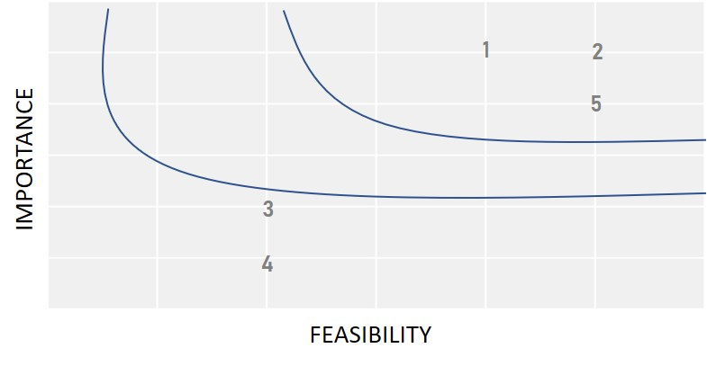
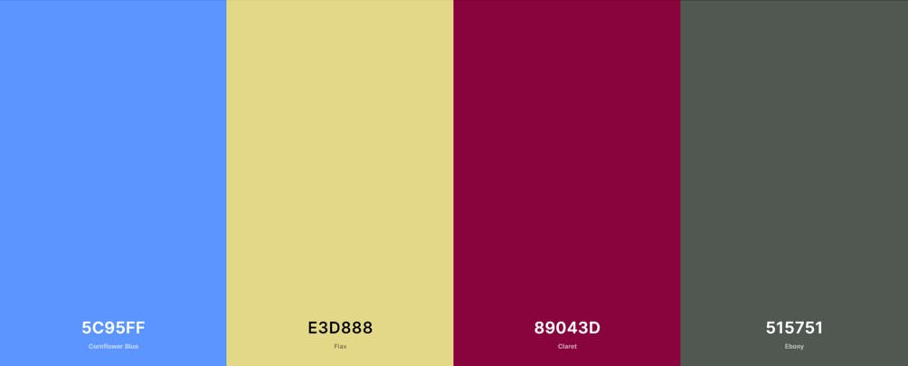

# Gothenburg Netball Club Project
## A simple website providing information about Gothenburg's Netball Club.
# Contents
1. Project Overview
2. UX
- Strategy
- Scope
- Structure
- Skeleton
- Surface
3. Continue
# Project Overview
This project is my Milestone Project One as part of the Full Stack Software Diploma Course with the Code Institute.

I am on the committee for the Gothenburg Netball Club: a team of amateur netball players, set up for English-speaking adults in Gothenburg. 
Sadly due to the current Covid-19 situation having such a negative impact on sports, we have been unable to have routine sessions, and therefore 
do not have a group of regular players.

I am taking this opportunity to create a simple, clearly structured website to promote the club, so that when we can start playing again in the 
spring, there is a larger awareness and interest in the club, encouring site visitors to join a session, and become paying members. It will also 
serve as a place that regular players can see upcoming training dates, times and locations. 

The club's current online presence is via [Facebook](https://www.facebook.com/gothenburgnetball/).
# User Experience Design (UXD)
## Strategy
The site has been designed using a mobile-first approach to ensure ease of obtaining information.

It is imperative that the look and feel of the site be friendly, feel local, and approachable: the objective is that people feel comfortable contacting 
the club and want to join us to play, even if just once. If the site feels too commercial, busy, or cold it will not provide this positive feeling to 
the user.

### Target audience
English-speaking adults (whether native or not), aged 18 or over, who wish to meet other people, whilst playing an amateur sport. Site users are based 
in Gothenburg, Sweden, or can travel to the city on a regular basis.

Users can have experience of netball, perhaps having played in school or college, or no experience at all. This is not a competitive environment: 
it is meant to be fun, therefore level of playing experience, or even knowlegde of the game is immaterial. All are welcome and the site must reflect this.

Where users have knowledge of the game and / or are interested in volunteering, we invite them to join the committee and / or provide help in 
umpiring / coaching.

### User stories
#### I am an English-speaking adult in Gothenburg and want to:
- Meet other English-speaking adults on a regular basis, and make new friends,
- Learn a new skill / sport,
- Improve my netball skills, a game I haven't played for years,
- Improve my fitness,
- Spend time with people that I have something in common with,
- Get out of the house,
- Have fun!

#### I am a new visitor to the site and want to:
- Understand what the club is and what it provides,
- Refresh my understanding of netball,
- Learn the basics of netball,
- Find out where and when practice is, 
- Understand the fees involved,
- Feel invited to join a session,
- Feel comfortable contacting someone for more information,
- Connect to the club's social media channels,
- Understand what I need to join,
- Understand what I will gain from coming to a session,
- Have an overview of the committee members.

#### I am a regular player / frequent site visitor and want to:
- Find out where and when practice is,
- Feel invited to join a session,
- Refresh my knowledge of netball,
- Find out the latest news about netball,
- Learn about future friendly matches and tours.

#### I am a club committee member and want to:
- Show case how much fun we have as a club,
- Encourage regular playing members,
- Build a strong, regular team so that we can attend matches and tours as a group,
- Encourage people to try a new sport,
- Invite players to join the committee and help us run the club,
- Provide clear information about who we are and what we do for future sponsorhsip opportunities.

## Scope
### Features
Utilising the trade-off equation, below details the features I have selected to be included in the intitial release, and ones to be considered 
in the future.

| --- | Importance | Feasibility |
| --- | :---: | :---: |
| 1. Increase number of paying members | 5 | 4 |
| 2. Increase attendees to trial sessions | 5 | 5 |
| 3. Offer digital sign-up and payment options to members | 2 | 2 |
| 4. Create sponsorship opportunities | 2 | 1 |
| 5. Build a basic online presence | 4 | 4 |

### Existing features

| Feature  | Details  |
|---|---|
| Nav bar | Simple, easy to understand naviagtion bar, always at the top of each page.  |
| Footer | Contact info, social media link (opening in new tab), membership form (opening in new tab) and organisation name and number.  |
| Images | Clean, real life images of the players, venues and social occassions.  |
| About  | Basic, simple information about who we are and what we do.  |
| Guide to netball  | Basic principles of the sport, which are easy to comprehend, including visual representation.  |
| Contact page  | Easy to use contact form. Club contact information and committee member details.  |
| Practice dates | Clean presentation of the date, time and location of upcoming sessions.  |
| Current information  | Covid-19 safe guidelines, future tours, national netball information.  |
| Favicon  | A constant reminder to the site user of the site they are on.  |
| What is needed to play | Checklist and fee information. |

### Future features planned

Once play resumes, the website is live and more people start playing there will be many opportunities to build on the website and expand it to meet 
the growing and changing needs of the club.

**Feature 1:** An online membership form with e-signature capability.
This feature has not been implemented in the first release as I do not yet have the knowledge to do so.

**Features 2:** Online payment methods for membership and sessions fees.
This feature has not been implemented in the first release as the club doesn't have a bank account and I do not yet have the knowledge to build 
this option into the site.

**Feature 3:** Sponsorship opportunities.
This feature has not been implemented in the first release as the club doesn't have the necessary presence yet to create interest from potential sponsors.

## Structure

The website is structured into four pages: Home | What is netball? | Get in touch | Photo gallery

Each page is responsive on various device sizes, has the same clean, simple structure and contain the navigation bar and footer. The navigation bar 
is static, and the favicon links back to the home page.

The layout is primarily based on Bootstrap's grid design, using my own css styling rules to acheive the desired look and style.

Each page will have the necessary internal links to direct the user in alignment with the relevant part of their online journey.

### Homepage
#### Content
- Welcome message
- About the club
- Next sessions dates, time and location
- Current information about Covid-19
#### Links
- What is netball?
- Get in touch

### What is netball?
#### Content
- Basic rules and principles of the sport
- Photos of professional play
- Diagrams (where appropriate)
#### Links
- Get in touch
- Photo gallery

### Get in touch
#### Content
- Contact form: Name (required), Email (required), Phone, Message
- Contact info: club email <!---phone number not included as personal, not company number--->
- Committee member basic info: photo, name, small bio
#### Links
- Session dates on homepage

### Photo gallery
#### Content
- Player and sports-related photo gallery

### Error 404
- In case users are directed to a broken link

## Skeleton

[**Mobile device wireframe](assets/images/wireframe-mobile-device.pdf)

[**Tablet devide wireframe](assets/images/wireframe-tablet.pdf)

[**Desktop device wireframe](assets/images/wireframe-desktop.pdf)

The wireframes were created using [Balsamiq](http://www.balsamiq.com) and demonstrate the responsive of the site on each device size, as well as the 
white space applied throughout the create a clean, simple structure which does not overload the user. The site presents the user with the information 
they are looking for, in a simple and logical manner.

## Surface
### Typography:
Using [Google Fonts](https://fonts.google.com/specimen/Permanent+Marker?preview.text=Gothenburg%20Netball%20Club%20Est.%202019%20Fun,%20fitness%20and%20friendship!&preview.text_type=custom)
I selected Permanent Marker for all navbar text, and h1, h2 and h3 headings throughout the site, as I felt it gave a feeling of friendliness and 
approachable that I was looking for to match the tone of the site.
As per Google Font's recommendation, the accommodating font used is Lato. Sans-serif is used should either of these fonts fail to load.
### Imagery:
The following three images used on the photos.html page are published on Gothenburg Netball's Facebook page, for which I am an administrator.
[Image 1 | ](assets/images/photo-gallery/group-1)
[Image 2 | ](assets/images/photo-gallery/group-2)
[Image 3 | ](assets/images/photo-gallery/group-4)
The other images on the page are stock images, sources from Unsplash.com, and acknowledged here:
[Image 4 | ](assets/images/photo-gallery/group-3) [Source](https://unsplash.com/@naassomz1?utm_source=unsplash&amp;utm_medium=referral&amp;utm_content=creditCopyText)
[Image 5 | ](assets/images/photo-gallery/group-5) [Source](https://unsplash.com/@iamchang?utm_source=unsplash&amp;utm_medium=referral&amp;utm_content=creditCopyText)
[Image 6 | ](assets/images/photo-gallery/group-6) [Source](https://unsplash.com/@linkedinsalesnavigator?utm_source=unsplash&amp;utm_medium=referral&amp;utm_content=creditCopyText)
The images used for the committee members were also sourced from Unsplash.com:
[Mark Darcy | ](assets/images/committee-members/mark-darcy.jpg) [Source](https://unsplash.com/@christianbuehner?utm_source=unsplash&amp;utm_medium=referral&amp;utm_content=creditCopyText)
[Bridget Jones | ](assets/images/committee-members/bridget-jones.jpg) [Source](https://unsplash.com/@eugabrielsilverio?utm_source=unsplash&amp;utm_medium=referral&amp;utm_content=creditCopyText)
[Daniel Cleaver | ](assets/images/committee-members/daniel-cleaver.jpg) [Source](https://unsplash.com/@_sean_hall_?utm_source=unsplash&amp;utm_medium=referral&amp;utm_content=creditCopyTex)
[Helen Fielding | ](assets/images/committee-members/helen-fielding.jpg) [Source](https://unsplash.com/@clemono?utm_source=unsplash&amp;utm_medium=referral&amp;utm_content=creditCopyText)
The flag icons were sourced from [Flacticon](http://flaticon.com) and are also sourced on the site.
### Color scheme:
The principle colors selected are variants of blue and yellow, the reason being two-fold: they are the colors of the Swedish flag, and other netball 
clubs in Sweden have red and green as their team colors. All color variants have been selected using [Coolors](https://coolors.co/) to compliment 
each other, and provide a feeling of safety and calm, as required in the strategy.

Toward the end of the project, based on feedback from Slack users and testers, I added color to the homepage to break up the white space and make it more
asthetically pleasing. 
### Favicon: 
I used the [basketball ball image from Font Awesome](https://fontawesome.com/icons/basketball-ball?style=solid) and used css styling to match the colors 
of the website as the favicon.
# Technologies used
This project was created using the following languages:

 - HTML 5
 - CSS

The project was created on GitPod.

This project was created using the following libraries and frameworks:

 - [Balsamiq](https://balsamiq.cloud/) - used to create all wireframes
 - [Bootstrap](https://getbootstrap.com/) - Bootstrap was used as the main grid structure for the site, for the navbar, including navbar toggler,
 and contact form.
 - [Google Fonts](https://fonts.google.com/specimen/Permanent+Marker?preview.text=Gothenburg%20Netball%20Club%20Est.%202019%20Fun,%20fitness%20and%20friendship!&preview.text_type=custom)
 - [Font Awesome](https://fontawesome.com/) - used for the [basketball ball favicon](https://fontawesome.com/icons/basketball-ball?style=solid) and 
 [checklist icons](https://fontawesome.com/icons/check-circle?style=regular)
 - [Free Formatter HTML](https://www.freeformatter.com/html-formatter.html) - for HTML code formatting
 - [Free Formatter CSS](https://www.freeformatter.com/css-beautifier.html) - to beautify CSS code
 - [Coolors](https://coolors.co/) - to select a color pallete to match the required tone of the site
 - [Stackoverflow](http://stackoverflow.com) - help with undertanding forms and navbar toggler 

# Testing:
I have created the website for mobile-usage, therefore I have used Chrome development tools throughout to ensure continuous testing of the look,
functionality and layout of the site.

# Deployment:

# Credits:
## Content:
- [Good reads](https://www.goodreads.com/author/quotes/6419544.Shanti) - provided the quote on the 
[photo gallery](https://catherinetrevor.github.io/gothenburg-netball/photos.html) page
- [Wikipedia](http://www.wikipedia.org) - source of basic netball info, and information about the 
[introduction of netball](https://en.wikipedia.org/wiki/Martina_Bergman-%C3%96sterberg)
- [Play Simple Netball](https://www.simplenetball.co.uk/rules/) - used to verify my own knowlegde of the rules, to ensure what I was writing was correct
- [Netball court illustration](assets/images/court-layout) - I drew this myself using Micorsoft Powerpoint and saved as a jpg, based on my own knowledge
- [Committee member quotes](https://catherinetrevor.github.io/gothenburg-netball/contact.html) - all quotes are purely fictional, written by me
## Media:
- [Unsplash](http://www.unsplash.com) - committee members, and some photo gallery images sourced from Unsplash. Specific sources cited in the above 
imagery section 
- Youtube video
- Gothenburg Netball club Facebook
Netball and smiley face graphic
Google maps
basketball image
country flags
## Acknowledgements:
While designing and developing this site, I took inspiration from the following websites;
* [Skåne Netball Club](https://skane-netball-club.webnode.com/)
* [Stockholm Netball Club](https://www.stockholmnetballclub.com/)
* [Netball Sweden (Sweden's national netball federation)](https://www.netball.se/)
* [Kent County Club](https://www.kcnc.org.uk/)
* [Nicole Saidy](https://nicolesaidy.com/)
* [Leen Heyne Collection](https://leenheyne.nl/jewelry-all)
* [Inspiration document](insert link)

While the club is real, the names of the other committee members are fictional and have been taken from the book Bridget Jones' Diary by Helen Fiedling.
