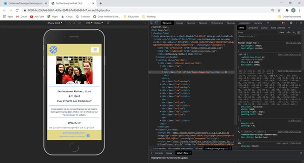
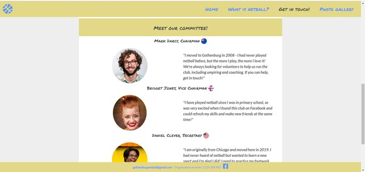

# Testing:

Having created the website for mobile-usage, I used Chrome development tools throughout to ensure continuous testing of the look,
functionality and layout of the site, whilst building it.

I made sure to also come out of the development tool and test it on real devices: my phone (iPhone SE2020), my husband's phone 
(iPhone 12) and a tablet device (iPad Pro 9.7").

As part of the testing process, I also sent the site to the chair of Netball Sweden, who provided the following feedback;

 - The top images on all pages took over the size of the page when viewed on a mobile device.
 - Suggested wording for an introduction to netball, as based on <a href="http://www.netballsweden.se" target="_blank">
 Netball Sweden's site</a>. 
 - Get in touch page is very friendly and welcoming.

Based on the user story requirements, I have carried out the following testing;

#### I am a new visitor to the site and want to:
- Easily understand what the club is and what it provides: offered in the opening paragraph on the homepage
- Refresh my understanding of netball: brief guidelines on the "what is netball page"
- Learn the basics of netball: brief guidelines, and a short video on the "what is netball page"
- Find out where and when practice is: a table and map on the homepage
- Understand the fees involved: text provided on the homepage
- Feel invited to join a session: friendly images, and welcome text inviting the user to join a session
- Feel comfortable contacting someone for more information: friendly contact form, and email address provided
- Connect to the club's social media channels: link to Facebook always in the footer
- Understand what I need to join: section on homepage giving such information
- Understand what I will gain from coming to a session: during the testing phase, this information was not clear enough, so I added some extra text to the
homepage welcome section, giving a clearer overview of the sessions. 
- Have an overview of the committee members: bio and picture provided on the contact page.

#### I am a regular player / frequent site visitor and want to:
- Find out where and when practice is: a table and map on the homepage
- Feel invited to join a session: friendly, welcoming text
- Refresh my knowledge of netball: brief guidelines on the "what is netball page"
- Find out the latest news about netball: this has not been deployed in this version of the project, but will be a future feature, linked to the Netball
Sweden site, based on what information members are looking for.
- Learn about future friendly matches and tours: this has not been deployed for this project. Until regular play starts again, this information does not exist.

#### I am a club committee member and want to:
- Showcase how much fun we have as a club: as per the photo gallery
- Encourage regular playing members: having an online presence, in a friendly tone will help achieve this
- Build a strong, regular team so that we can attend matches and tours as a group: as above, new players will be encouraged to try us out
- Encourage people to try a new sport: giving basic guidelines and information on the game
- Invite players to join the committee and help us run the club: written in the chairman's bio
- Provide clear information about who we are and what we do for future sponsorship opportunities: specifically sponsorship will be addressed in future deployment,
but information about who we are is provided on the homepage.

#### Easily navigate to homepage

1. Click on the favicon on each page
2. This will take the user back to the homepage

#### Easily contact the club

1. Click on the email address in the footer
2. This opens a new blank email message, with the club email address in the To friendly

1. Navigate to Get in touch page
2. Fill in contact form
3. The form will not submit without a name and valid email address
4. For this project, the submit button does not navigate anywhere

At the bottom homepage and what is netball page, there is a large "get in touch" button, linking to the contact page. 

## Bug fixes:

### Top images on mobile device

As a result of testing the site on a mobile device, the chair of Netball Sweden and myself discovered a big bug for the images at the top of 
each page, that was not visible on Chrome development tools.

This was solved through increasing the specificity of the image within the div, to ensure the size on smaller screens was always small and contained within the div.

            

                 
                

                                                                  
                

                 
            

### Youtube video not displaying on iPad

When testing the site on the iPad, the Youtube video on the "What is netball" page doesn't display. 

After doing online research reading various sites, including [Apple discussions](https://discussions.apple.com/thread/2386735) and information 
from [XSPDF](https://www.xspdf.com/resolution/58337652.html) to see if it was browser specific. I also tested [Netball Sweden](http://www.netball.se)
and the same happens for their Youtube videos. I assume the cause is related to capability between the tablet and Youtube, but am not sure. 
Without the knowledge to fix this bug, I have chosen to hide the div on tablet sized devices, using Bootstrap's "d-md-none" class on the row.

                

                    

                        <h3>
                            Take a look...
                        </h3>
                    

                

                 
                

                    

                        <iframe width="560" height="315" src="https://www.youtube.com/embed/WGaYDvaZ4No" frameborder="0" 
                        allow="accelerometer; autoplay; clipboard-write; encrypted-media; gyroscope; picture-in-picture" allowfullscreen 
                        sr-only="Youtube video explaining rules and facts of netball"></iframe>                
                    

                

### Too much white space

Toward the end of the project, based on feedback from Slack users and testers, I added background colour to the homepage to break up the white space 
and make it more aesthetically pleasing. I used the grey #515751 rgb code and added opacity to keep it in the same style, but make it subtle. I then added
white to the main section to make it stand out.

            .section {
                    background-color: rgba(81, 87, 81, 0.10);
            }

### Change to original layout

In the original wireframe for the committee members, I had the image and text alternate to provide clarity. During development this proved too
difficult for me to keep the responsive behaviour on all devices, therefore the layout is a simple header, image, then text layout for consistency.

