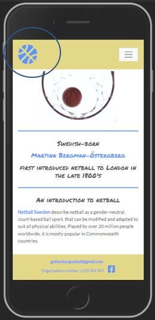
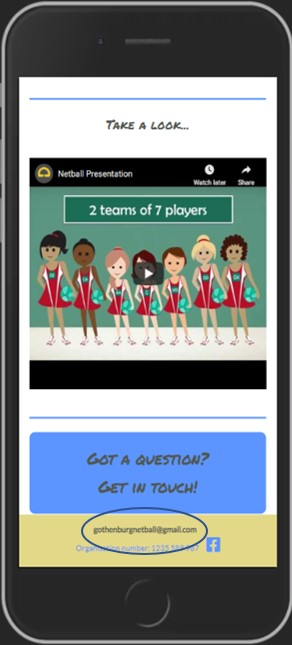
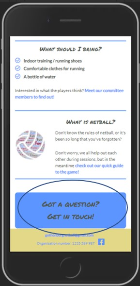
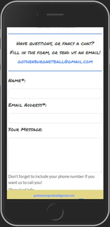
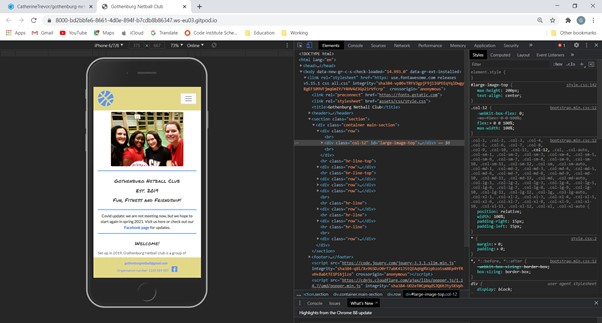
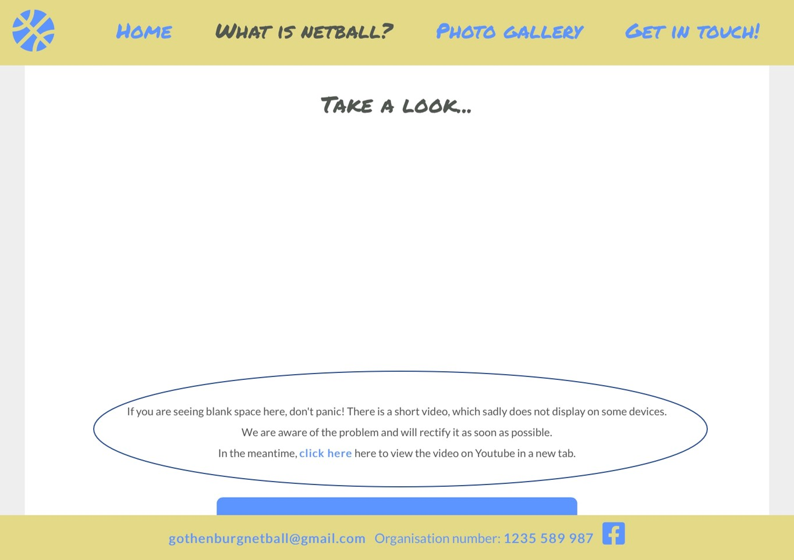
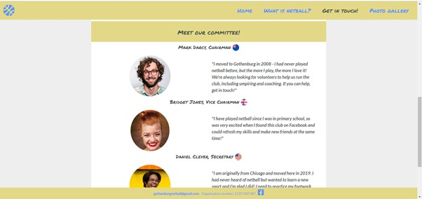

# Testing:

Having created the website for mobile-usage, I used Chrome development tools throughout to ensure continuous testing of the look,
functionality and layout of the site, whilst building it.

I made sure to also come out of the development tool and test it on real devices: my phone (iPhone SE2020), my husband's phone 
(iPhone 12) and a tablet device (iPad Pro 9.7").

As part of the testing process, I sent the site to the chair of Netball Sweden, who provided the following feedback;

 - The top images on all pages took over the size of the page when viewed on a mobile device.
 - Suggested wording for an introduction to netball, as based on <a href="http://www.netballsweden.se" target="_blank">
 Netball Sweden's site</a>. 
 - Get in touch page is very friendly and welcoming.

**User story testing**

Testing has been carried out to ensure the site meets the needs of visitors, inline with the user stories. Below explains how the requirements are met, including
a link to an image to give clarity on where in the site specifically. 

**First time visitor goals:**

| User story | How the site meets the requirement
|---|---|
| a. As a first time visitor I want to, easily understand what the club is and what it provides. | [Details of the club are provided in the opening paragraph of the homepage](supporting-docs/uat1.jpg) |
| b. As a first time visitor I want to, refresh my understanding of netball. | [There are brief guidelines on the "what is netball page"](supporting-docs/uat2.jpg) |
| c. As a first time visitor I want to, learn the basics of netball. | [Brief guidelines, and a short video is offered on the "what is netball page"](supporting-docs/uat3.jpg) |
| d. As a first time visitor I want to, find out where and when practice is.  | [A table and map with details is on the homepage](supporting-docs/uat4.jpg) |
| e. As a first time visitor I want to, understand the fees involved. | [Text explaining the fees is provided on the homepage](supporting-docs/uat5.jpg) |
| f. As a first time visitor I want to, feel invited to join a session. | [Friendly images are included throughout, as well as welcome text inviting the user to join a session](supporting-docs/uat6.jpg) |
| g. As a first time visitor I want to, feel comfortable contacting someone for more information. | [Friendly contact form, with basic information requested, and email address provided](supporting-docs/uat7.jpg) |
| h. As a first time visitor I want to, connect to the club's social media channels. | [There is a link to Facebook always in the footer, across all devices](supporting-docs/uat8.jpg) |
| i. As a first time visitor I want to, understand what I need to join. | [There is a section on the homepage specific to this information](supporting-docs/uat9.jpg) |
| j. As a first time visitor I want to, understand what I will gain from coming to a session. | [During the testing phase, this information was not clear enough, so I added some extra text to the homepage welcome section, giving a clearer overview of the sessions.](supporting-docs/uat1.jpg) |
| k. As a first time visitor I want to, have an overview of the committee members. | [A short bio and picture is provided on the contact page](supporting-docs/uat(a).jpg) |

**Returning visitor goals:**

| User story | How the site meets the requirement |
|---|---|
| a. As a returning visitor I want to, find out where and when practice is. | [A table and map is provided on the homepage](supporting-docs/uat(b).jpg) |
| b. As a returning visitor I want to, feel invited to join a session. | [The site contains friendly, welcoming text](supporting-docs/uat(c).jpg) |
| c. As a returning visitor I want to, refresh my knowledge of netball. | [Brief guidelines provided on the "what is netball page"](supporting-docs/uat2.jpg) |
| d. As a returning visitor I want to, find out the latest news about netball. | This has not been deployed in this version of the project, but will be a future feature, linked to the Netball Sweden site, based on what information members are looking for |
| e. As a returning visitor I want to, learn about future friendly matches and tours. | This has not been deployed for this project. Until regular play starts again, this information does not exist |

**Frequent visitor/committee member goals:**

| User story | How the site meets the requirement |
|---|---|
| a. As a frequent site visitor I want to, showcase how much fun we have as a club on a digital platform.| [Photos displayed in the photo gallery](supporting-docs/uat(d).jpg)
| b. As a frequent site visitor I want to, encourage regular playing members. | [Having an online presence, in a friendly tone will help achieve this](supporting-docs/uat(c).jpg) |
| c. As a frequent site visitor I want to, build a strong, regular team so that we can attend matches and tours as a group.| A digital platform will help encourage new players to join |
| d. As a frequent site visitor I want to, encourage people to try a new sport.| [Basic guidelines and information on the game is offered](supporting-docs/uat3.jpg) |
| e. As a frequent site visitor I want to, invite players to join the committee and help us run the club. | [This information is given in the chairman's bio](supporting-docs/uat(e).jpg) |
| f. As a frequent site visitor I want to, provide clear information about who we are and what we do for future sponsorship opportunities. | Sponsorship will be addressed in future deployment: at present [information about who we are is provided on the homepage](supporting-docs/uat1.jpg) |

**Testing ease of use**

**Easily navigate to homepage from any page**

1. Click on the favicon in the top left of each page, available on all devices.

    

2. This will take the user back to the homepage everytime.

**Easily contact the club**

1. Click on the email address in the footer of each page.

    

2. This opens a new blank email message, with the club email address in the "To" field.

1. Navigate to Get in touch page, via the navigation bar, or Get in touch buttons.

    

2. Fill in contact form.

    

3. The form will not submit without a name and valid email address.
4. For this project, the submit button at the bottom of the form does not navigate anywhere. This will be corrected in future releases.

At the bottom homepage and what is netball page, there is a large "get in touch" button, linking to the contact page. 

## Bug fixes:

### Top images on mobile device

As a result of testing the site on a mobile device, the chair of Netball Sweden and myself discovered a big bug for the images at the top of 
each page, that was not visible on Chrome development tools.

Researching the problem, I read one article on [David Walsh's blog](https://davidwalsh.name/image-max-width) regarding image width, and after revaluating my css, understood my specificity was not high enough to control the image size.

This was solved through increasing the specificity of the image within the div by adding an ID to the image, to ensure the size on smaller screens was always small and contained within the div.

            

                 
                

                                                                  
                

                 
            

### Youtube video not displaying on iPad

When testing the site on the iPad, the Youtube video on the "What is netball" page doesn't display. Initially, I removed it from tablet-sized devices, however
following a discussion with my mentor, and further research, this would mean that anyone watching the video on a tablet other than an iPad, will not be able to
view the video also.

I also tested [Netball Sweden](http://www.netball.se) on the tablet and the same happens for their Youtube videos, where they do not appear.

As part of my research to understand the problem, I read articles online including [Apple discussions](https://discussions.apple.com/thread/2386735), 
and [XSPDF](https://www.xspdf.com/resolution/58337652.html). I thought it might be browser specific. 
[This article from E-Learning Heroes](https://community.articulate.com/discussions/articulate-storyline/embedded-youtube-video-will-not-play-on-ipad) provides a
clearer explanation.

In conclusion, the video remains on the site, but with this known problem. It is not my video, so I cannot fix its compatibility, although I understand the bug can be 
fixed using Javascript: I do not yet have the knowledge for this. I have therefore added small text underneath the video, to explain the reason, 
if a visitor does not see the video, until the bug has been fixed.

### Too much white space

Toward the end of the project, based on feedback from Slack users and testers, I added background colour to the homepage to break up the white space 
and make it more aesthetically pleasing. I used the grey #515751 rgb code and added opacity to keep it in the same style, but make it subtle. I then added
white to the main section to make it stand out.

            .section {
                    background-color: rgba(81, 87, 81, 0.10);
            }

### Change to original layout

In the original wireframe for the committee members, I had the image and text alternate to provide clarity. During development this proved too
difficult for me to keep the responsive behaviour on all devices, therefore the layout is a simple header, image, then text layout for consistency.

### Top margin hiding text for internal anchors

The internal link from index.html to contact.html which opens at the committee members section, as well as the link from "How do I join" to "When and where"
also on index.html, were not showing correctly: this was due to the margin at the top of each page, which is used to compensate for the space taken by the 
navigation bar. To the visitor, it looked that the anchor point was taking them to the wrong part of the page.

To fix this, the anchor links to a few rows above the text, so when clicked the visitor sees the correct section of text.

### Code validator
[css: no errors found](https://jigsaw.w3.org/css-validator/validator)

